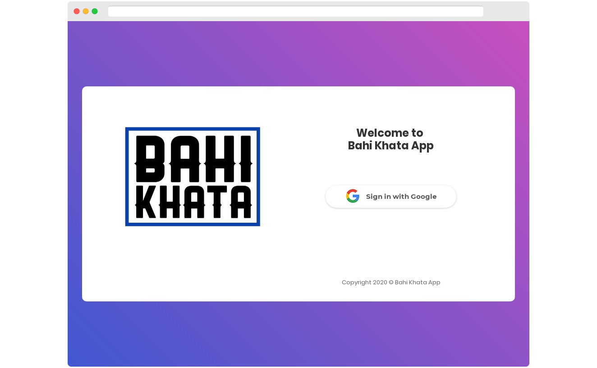
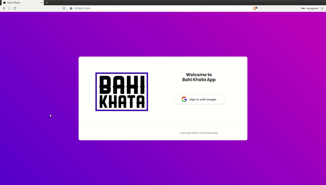
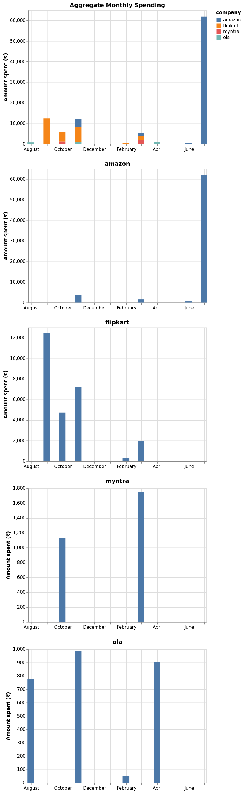

<!-- PROJECT LOGO -->
<br />
<div align="center">
    <a href="https://github.com/Bahi-Khata-App/Bahi-Khata">
      
    </a>
    <h3 align="center">बही खाता</h3>

  <div align="center">
    A Python app to help you become prudent in your spendings
    <br />
    <br />
    <a href="https://bahi-khata-app.herokuapp.com">View Demo</a>
    ·
    <a href="https://github.com/Bahi-Khata-App/Bahi-Khata/issues">Report Bug</a>
    ·
    <a href="https://github.com/Bahi-Khata-App/Bahi-Khata/issues">Request Feature</a>
  </div>
</div>


<!-- TABLE OF CONTENTS -->
## Table of Contents

- [Table of Contents](#table-of-contents)
- [About The Project](#about-the-project)
- [Supported Receipts](#supported-receipts)
- [Built With](#built-with)
- [Getting Started](#getting-started)
  - [Prerequisites](#prerequisites)
  - [Installation](#installation)
- [Usage](#usage)
- [Deployment](#deployment)
- [Roadmap](#roadmap)
- [Contributing](#contributing)
- [License](#license)
- [Authors](#authors)
- [Acknowledgements](#acknowledgements)





<!-- ABOUT THE PROJECT -->
## About The Project

> Where does all my money go?

If you have been asking this question to yourself frequently, you are not alone. Handling finances can be tricky. This project is an attempt to help you plan right, so that you worry less while living from paycheck to paycheck.


## Supported Receipts

- [x] Amazon

- [x] Flipkart

- [x] Myntra

- [x] Ola

- [x] Uber

- [ ] Zomato

- [ ] Swiggy

- [ ] Curefit


## Built With

* [Flask](https://flask.palletsprojects.com/en/1.1.x)
* [Heroku](http://heroku.com)
* [Gmail API](https://developers.google.com/gmail/api)
* [Beautiful Soup](https://www.crummy.com/software/BeautifulSoup)
* [Altair](https://altair-viz.github.io)
* [SendGrid](https://sendgrid.com)


<!-- GETTING STARTED -->
## Getting Started

These instructions will get you a copy of the project up and running on your local machine for development and testing purposes. See [deployment](#deployment) for notes on how to deploy the project on a live system.

### Prerequisites

* python `>=3.6`
* pip
* [Chrome](https://www.google.com/chrome)
* [ChromeDriver](https://chromedriver.chromium.org)


### Installation

1. Clone the repo
```sh
git clone https://github.com/Bahi-Khata-App/Bahi-Khata
```
2. Install the dependencies
```sh
pip install -r requirements.txt
```
3. Setup Gmail API
   1. Check `gmail.readonly` scope in your Gmail API OAuth consent page
   2. Add `http://localhost:5000/push` as redirect URI while generating credentials
   3. Download and place your Gmail API credentials in `data/credentials.json`
4. Place your SendGrid API credentials in `data/sendgrid.json`
5. (Optional) Place your analytics tracking script in `base.html`


<!-- USAGE EXAMPLES -->
## Usage

1. Set flask environment variable
```sh
export FLASK_APP="gmail_flask.py"
```
2. Set `LOCAL_DEV = True` in `gmail_flask.py`
3. `flask run`
4. Complete the one time app verification



5. If any relevant data is found, you'll receive an email report similar as below




<!-- DEPLOYMENT -->
## Deployment

1. Set up [Heroku CLI](https://devcenter.heroku.com/articles/heroku-cli).
2. Add redirect URI `<HEROKU_APP_LINK>/push` in Gmail API console.
3. Add the [chromedriver](https://github.com/heroku/heroku-buildpack-chromedriver) and [google-chrome](https://github.com/heroku/heroku-buildpack-google-chrome) buildpacks in app settings on your Heroku dashboard.
4. Configure environment variables for your app in the dashboard.

| KEY                 | VALUE                                 |
| ------------------- | ------------------------------------- |
| `CHROMEDRIVER_PATH` | `/app/.chromedriver/bin/chromedriver` |
| `GOOGLE_CHROME_BIN` | `/app/.apt/usr/bin/google-chrome`     |


<!-- ROADMAP -->
## Roadmap

See the [open issues](https://github.com/Bahi-Khata-App/Bahi-Khata/issues) for a list of proposed features (and known issues).


<!-- CONTRIBUTING -->
## Contributing

Contributions are what make the open source community such an amazing place to be learn, inspire, and create. Any contributions you make are **greatly appreciated**.

1. Fork the Project
2. Create your Feature Branch (`git checkout -b feature/AmazingFeature`)
3. Commit your Changes (`git commit -m 'Add some AmazingFeature'`)
4. Push to the Branch (`git push origin feature/AmazingFeature`)
5. Open a Pull Request


<!-- LICENSE -->
## License

Distributed under the GPLv3 License. See `LICENSE` for more information.


<!-- AUTHORS -->
## Authors

* [Rohit Ner](https://github.com/rohitner)
* [Nishant Nikhil](https://github.com/nishnik)


<!-- ACKNOWLEDGEMENTS -->
## Acknowledgements

* Hat tip to anyone whose code was used
